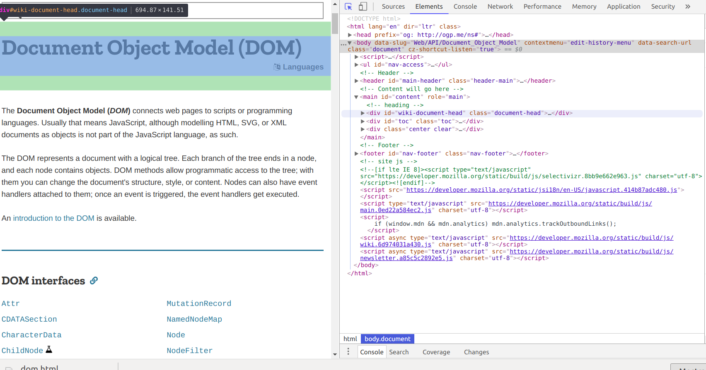

# HTML


1. [Intro](#intro)
    1. Syntax Structure
    
2. [Main Tags](#tags)

3. [Comments](#comments)


## <a name="intro"></a> 1. Intro

HTML stands for **HyperText Markup Language** and it is used to add and structure information 
we want in our webpage. It includes tags, attributes and flags that help structure content.  

HTML is the foundation for EVERY website. Its purpose is to organize content.

HTML is not concerned about how the content looks. That job is left to CSS.

When a web page is loaded, the browser creates a [DOM](https://developer.mozilla.org/en-US/docs/Web/API/Document_Object_Model) (Document Object Model). This only means that the browser creates its own image of how our page looks like based on how we structure HTML. That is one of the reasons why having an organized HTML is important.
Here you can see how a browser gets an image of your page: 



##### 1.1. [Syntax Structure](https://github.com/Ada-Developers-Academy/textbook-curriculum/blob/master/05-html-css/css-intro.md#css-syntax-structure)

##### HTML elements

Every piece of website content is 'wrapped' in an HTML element. An HTML element is usually composed of two tags, an opening tag and a closing tag (though we will see there are exceptions). Content, such as text or other HTML elements, will be displayed within these tags. Tags have associated behaviours of the elements. 
`<p>Text</p>`
Opening tags can include modifiers, called **attributes** that modify default behaviour of the element, or add
extra information.
In this case, the `lang` attribute in the `p` tag is telling information about the language of the text.
```html
<p lang="es">Párrafo</p>
```

###### Nested Elements
Tags can be nested inside of other tags. To maintain readable code, the parent tags (the outer most ones) should each be on a new line with the nested element indented. Example:
```html
<div>
  <h1>Title</h1>
  <p>Text</p>
</div>
```

###### Self Closing Elements
Some elements do not need a closing tag. Some examples are:
```html
  <br /> 
  
  <link />
  <meta />
  ```

###### Types of tags
Tags can be classified in 2 types; tags that define the document and tags that define content.
1. Tags that define the **document** :

```html
<!DOCTYPE html>
<html lang="en">
<head>
    <meta charset="utf-8">
    <title>My webpage</title>
</head>
<body>

</body>
</html>
```
The `<!DOCTYPE html>, <html>, <head>` and `<body>` tags  are fundamental for every webpage.
You can read more about these tags here: 
[doctype](https://stackoverflow.com/questions/414891/what-is-doctype) , 
[html](https://stackoverflow.com/questions/3270615/why-we-use-html-tag-although-my-website-runs-perfect-without-html-tag) , 
[head](https://developer.mozilla.org/en-US/docs/Web/HTML/Element/head) ,
[body](https://htmldog.com/references/html/tags/body/)


2. Tags that define **content**:
Within the <body></body> tag we can include our content tags. 
Browsers will read tags respecting writing order, so we must place them in the order
we intend to. Moreover, the use of correct tags will give our content semantic value, useful for
developers, crucial for [SEO](https://developer.mozilla.org/es/docs/Glossary/SEO) (search engine optimization) and important for [accessibility](https://developer.mozilla.org/en-US/docs/Web/Accessibility/ARIA). 

## <a name="tags"></a> 2. Main tags
- `<h1>, <h2>, <h3>, <h4>, <h5>, <h6>` used for titles.
- `<p>` for adding text (paragraph).
- Unordered lists:
```html
  <ul>
    <li>List element</li>
    <li>List element</li>
  </ul>
```
- Ordered lists:
```html
  <ol>
    <li>List element</li>
    <li>List element</li>
  </ol>
```
- `<div> and <spans>` are containers.
- `<a href="http://madridforrefugees.org/es/">` The `<a>` tag defines a hyperlink, which is used to take us from one page to another (absolute routes) or to a different part of the same page (relative routes). 
- `<header>`: A heading section.
-`<main>`: Principal section of content.
- `<footer>`: A section at the end of a block.
- `<nav>`: A navigation menu.
- `<aside>`: An un related or less important section.
- `<article>`: An article.
- `<button>` : A button that tells users they can perform an action. 

And a lot of other tags which you can research [here](https://www.w3schools.com/tags/).

**Example of common HTML structure**

```html
<!DOCTYPE html>
<html lang="es">
<head>
    <meta charset="utf-8">
    <title>My webpage</title>
</head>
<body>
    <header id="top">
        <h1>Title</h1>
    </header>
    <main id="main">
        <h2>Some awesome thing!</h2>
        <p>Cats are not as cute as dogs</p>
    </main>
    <footer>
        <div><a href="#top">Go to Top</a></div>
    </footer>
</body>
</html>
```


## <a name="Comments"></a> 3. Comments

In order to add a comment in html:
```html
<!--This is a comment. Comments are not displayed in the browser-->

<p>This is a paragraph.</p>
```

### How to modify default tags

We have seen that tags have their own behaviour, for example a `<button>` by default will be clickable.
But we also saw that we can change these behaviours. 

There might be cases in which we want to change all behaviours associated with a tag. For instance, we
might want all fonts in `<body>` to be the same. In this case, selecting `body` will be enough.

However, sometimes we will need only some buttons to be green, some blue, some links to perform an action... 
The solution to do so is to implement `id` and `class` so that you can control which elements you are **selecting** . 

You will see more about selectors in the CSS section. 


###### Exercise

Create a skeleton of different webpages: 
    1. A newsletter.
    2. A shopping page.
    3. A blog.

Can you see the content will be distributed using different sections?
What will be predominant in a newsletter, `<article></article>` or `<button></button>` ?
What about a shopping site?
Can you see the use of different tags?


* * *

## References 
- [Ada Developers Academy](https://github.com/Ada-Developers-Academy/textbook-curriculum/blob/master/05-html-css/html-intro.md) .
- [Curso programación front end Adalab](https://books.adalab.es/curso-programacion-front-end-2018/) .