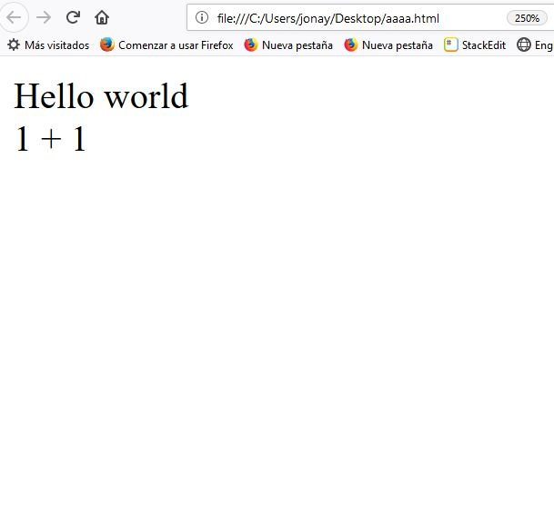
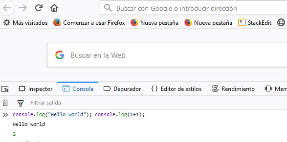
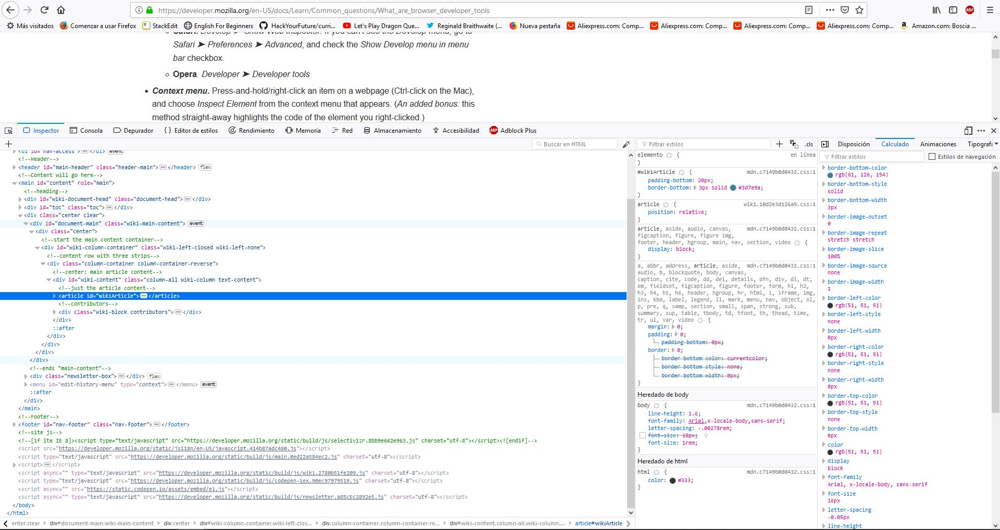
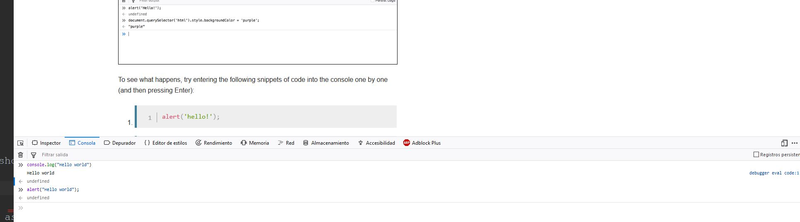
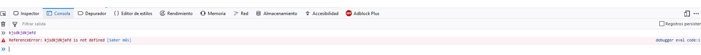

What is computer programming?
--------------------------------

Computer programming is a way of giving computers instructions about what they should do next. 
These instructions are known as code, and computer programmers write code to solve problems or perform a task.

The end goal is to create something: that could mean anything from a web page, or a piece of software, or even just a pretty picture. 
That’s why computer programming is often described as a mix between art and science; it’s technical and analytical, yet creative at the same time.


in this video explain quickly, that is programming.

[What is Programming?](https://www.youtube.com/watch?v=FCMxA3m_Imc)

What is javascript?
-----------------------

JavaScript is a scripting or programming language that allows you to implement complex things on web pages
every time a web page does more than just sit there and display static information for you to look at
displaying timely content updates, interactive maps, animated 2D/3D graphics, scrolling video jukeboxes, etc.
You can bet that JavaScript is probably involved. 
It is the third layer of the layer cake of standard web technologies, two of which (HTML and CSS).

- HTML is the markup language that we use to structure and give meaning to our web content, 
for example defining paragraphs, headings, and data tables, or embedding images and videos in the page.

- CSS is a language of style rules that we use to apply styling to our HTML content, for example setting background colors and fonts, 
and laying out our content in multiple columns.

- JavaScript is a scripting language that enables you to create dynamically updating content, control multimedia, animate images, and pretty much everything else.


## Interpreted versus compiled code


You might hear the terms interpreted and compiled in the context of programming.
 In interpreted languages, the code is run from top to bottom and the result of running the code is immediately returned. 
 You don't have to transform the code into a different form before the browser runs it.

Compiled languages on the other hand are transformed (compiled) into another form before they are run by the computer.
 For example, C/C++ are compiled into assembly language that is then run by the computer.

JavaScript is a lightweight interpreted programming language. Both approaches have different advantages, which we won't discuss at this point.

## Server-side versus client-side code

You might also hear the terms server-side and client-side code, especially in the context of web development.
Client-side code is code that is run on the user's computer when a web page is viewed, the page's client-side code is downloaded,
then run and displayed by the browser. In this module we are explicitly talking about client-side JavaScript.

Server-side code on the other hand is run on the server, 
then its results are downloaded and displayed in the browser. 
Examples of popular server-side web languages include PHP, Python, Ruby, ASP.NET and... JavaScript! 
JavaScript can also be used as a server-side language, for example in the popular Node.js environment.


## Difference between markup language and programming language


**Review:** 
the whole idea of a mark up language is to avoid the formatting work for the text, as the tags in the mark up language serve the purpose to format the appropriate text 
(like a header or the beginning of a paragraph etc.). Every tag used in a Markup language has a property to format the text we write. 


**Markup language**

- Example:

```
<div>Hello world</div>
<div>1 + 1<div>
```


- Result:



**Programming language**

- Example:

```
console.log("Hello world"); console.log(1+1);
```
- Result:



The programming language can do math calculates and how we'll see in the programming language also have behavior.

# What are browser developer tools?

Every modern web browser includes a powerful suite of developer tools. 
These tools do a range of things, from inspecting currently-loaded HTML, CSS and JavaScript to showing which assets the page has requested and how long they took to load. 



## The JavaScript console

The JavaScript console is an incredibly useful tool for debugging JavaScript that isn't working as expected. 
It allows you to run lines of JavaScript against the page currently loaded in the browser, and reports the errors encountered as the browser tries to execute your code.
To access the console in any browser
 



Now try entering the following incorrect versions of the code and see what you get.



You'll start to see the kind of errors that the browser returns. Often these errors are fairly cryptic, but it should be pretty simple to figure these problems out!


How do you add JavaScript to your page?
-------------------


## Internal JavaScript
Open the file in your web browser and in your text editor. You'll see that the HTML creates a simple web.
Next, go to your text editor and add the following in your head — just before your closing </head> tag: 
```
<script>
     // JavaScript goes here
   
   
    //Example. Display an alert box
    alert("First way | Internal JavaScript");
    
    //Print message in console
    console.log("First way | Internal JavaScript");
</script>
```

## External JavaScript

1. First, create a new file in the same directory as your sample HTML file. 
Call it script.js make sure it has that .js filename extension,
as that's how it is recognized as JavaScript.

2. Replace your current <script> element with the following:
```
<script src="script.js"></script>
```


3. Inside script.js, add the following script: 
```javascript
     // JavaScript goes here
   
    //Example. Display an alert box
    alert("Second way | Internal JavaScript");
    
    //Print message in console
    console.log("Second way | External JavaScript");
```


# Our template

```
<script type="text/javascript" src="main.js"></script>
```

in the file:

```javascript
class Main{
	execute(){
		//this is one comment
		// JavaScript goes here
		alert("Third way | Good way");
		console.log("Third way | Use Template");
	}
}
new Main().execute();
```

When we are working in class we use this structure.
For now only write our code within the execute.
With this we include file and work with object.Normally work this way.
This way it's very complex. A object is like box.You introduce your code
within so you can use the box in several places.
For now it's enough for us.We'll return here in the future.

[template](https://gist.github.com/jonayGodoy/bb91fab7e696d88ff429e3242a15fe18)