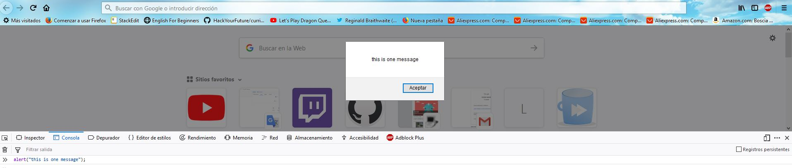

## Important
To complete this exercise, you'll need to use both **alert** and **prompt** methods.
Use the template to do your exercises.

- **prompt(message, defaultOption)** displays a popup with an optional message prompting the user to input some text.
  The second parameter is optional. If you provide a default option, this will be the default value of the text input.

Example:
```javascript
     let name = prompt("Please enter your name", "Harry Potter");
     console.log(name);

     let response = prompt("How are you?");
     console.log(response);
```


- The **alert(message)** method displays an alert dialog with the optional specified content and an OK button.

Example:
```javascript
    alert("this is one message");
```




# Quiz(little-kahoot)

- Create a program that shows the following questions to the user.
- The user should start with 0 points.
- If the user answers a question correctly, add 100 points to their score.
- If the user answers incorrectly, substract 100 points from their score.
- Once the user has answered all the 5 questions, display the final score.

Questions Example:

1. Question: "What is the name of the character played by Johnny Depp in the Pirates of the Caribbean film series?"
correct answer: "Jack Sparrow".

2. question: "How many books has the Harry Potter saga"
correct answer: "7".

3. question: "What are the first four digits of Pi?"
correct answer: "3.1415".

4. question: "How many countries are there in the world?"
correct answer: "195".

5. question: "Who's the current president of the UN?"
correct answer: "María Fernanda Espinosa Garcés".