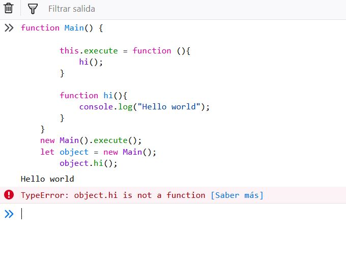

# Object-oriented programming

Object-oriented programming (oop) is a programming.
object refers to a particular instance of a class, where the object can be a combination of variables, functions, and data structures.
This is very important. Normally the object represent a entity, for examplea user, a car, a purchase. With object you can create modules.

Modularity is the ability to divide the problem into small independent parts, this goes beyond the encapsulation of a simple procedure of structured programming that we have seen so far. Here a set of operations and data that are closely related to each other forming a module is encapsulated.

An object-based language gives us the ability to define objects like javascript.

Remenber the main different between function and object is that object represent one entity.
A entity is one code fragment that has information, behavior and a representation the real world.


## Class and Object

The way easier for explain class and object.
The class is a cookies mold and the object is the cookie.

Therefore you can build a lot objects with one class.

### Syntax

```javascript
function Main {

    this.execute = function (){
        //this is one comment
        //your code
        console.log("Hello world");
    }
}
//you can execute object without variables
 new Main().execute();

//you can execute object in variables
let object = new Main();
object.execute();
```

 The Syntax is very similar that function but has important differents.

 - **new** The new operator lets developers create an instance of a user-defined object type or of one of the built-in object types that has a constructor function.
 Therefore each time you execute new you use the **class** for create a new **object**.

 - **this**. You can use this for share methods and properties in other place in your code.
  (this behaves a little differently in JavaScript compared to other languages).

## Control the access with "This".

 We carry on with "this". We can control the access, this important we only  should show the main methods out our class.


### Share you method

```javascript
function Main() {

    this.execute = function (){
        hi();
    }

    function hi(){
        console.log("Hello world");
    }
}
new Main().execute();
let object = new Main();
    object.execute();
```
Fine, all correct. You have access.


### Don't share you method

```javascript
function Main() {

    this.execute = function (){
        hi();
    }

    function hi(){
        console.log("Hello world");
    }
}
new Main().execute();
let object = new Main();
    object.hi();
  ```

  Fine, all correct. You don't have access.
  When you try entry in function that doesn't share you can read.
  "TypeError: object.hi is not a function".
  This error is little confuse.
  How we can't access the object this error is show.

  


## Properties
A property is one varible that all method in one object have access. 
This variable type could be dangerous if you use a lot properties of in the same class. 
If this happen your code will be hard for work and understand.


```javascript
function Main() {
    let greeting = "Hello world";

    this.execute = function (){
        hi();
    }

    function hi(){
        console.log(greeting);
    }
}
new Main().execute();
  ```
  
  ```javascript
function User() {
    let name = "David";
    let age = "25";

    this.showUserName = function (){
        console.log(name);
    }

    this.hi = function (){
        console.log("i'm "+name+" i have "+age+" years old.");
    }
}
let user = new User();
user.showUserName(); // show David
user.hi(); //show "i'm david i have 25 years old."
  ```
  
- Also you can use **this** share you property with other.

```javascript
function User() {
    this.name = "David";
    this.age = "25";

    this.showUserName = function (){
        console.log(this.name);
    }

}
let user = new User();
user.showUserName(); // show David
console.log("i'm "+user.name+" i have "+user.age +" years old."); //show i'm David i have 25 years old.
 ```
  
## Constructor

In the moment when you build a new object you can introduce parameters.
This parameters are for construct the new object with information since first moment.
The place where you introduce this parameters is the Contructor.

```javascript
function User(name, age) {  //Constructor
    this.name = name;
    this.age = age;

    this.showUserName = function (){
        console.log(this.name);
    }

}
let user = new User("David","25");  //Constructor
user.showUserName(); // show David
console.log("i'm "+user.name+" i have "+user.age +" years old."); //show i'm David i have 25 years old.
 ```

## Getters and Setters
empty


## POJO Plain Old Javascript Object

A POJO (Plain Old Javascript Object) is a object special type.
The main functionality in this object is share information that simpler way that a common object.

## The Syntax

The POJO is design for share information in consequence the syntax is very different.

```javascript
let user = {
    name: "David",
    age: "25"
}
 console.log("i'm "+user.name+" i have "+user.age+" years old."); // show i'm David i have 25 years old.
```


