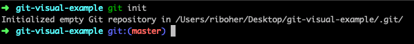
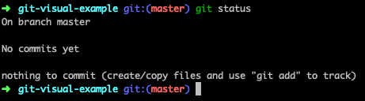
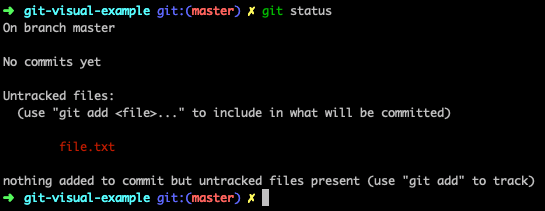
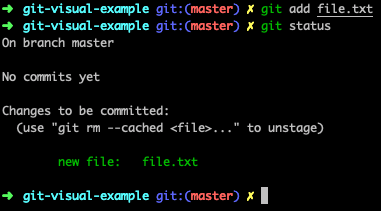
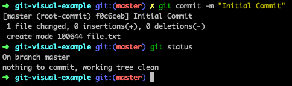
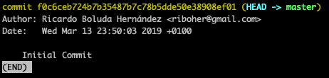
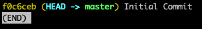

# Git

Git is a [revision control system](https://en.wikipedia.org/wiki/Version_control), also known as a version control system or VCS. It's a program that manages how your source code changes over time. For the most part, you could say that we use a VCS like Git to take snapshots of the status of our code at a given point in time. That means that we will have a series of snapshots of our code that together form a history. It’s even cooler than it sounds.

## How to install Git

For MFR course, you'll have to install Git and also create a Github account (which you should have by now). For simplicity, let's say that git is the program that you need to use in your computer to upload your code to Github, where you'll be able to save it and we'll see it throughout the course.

### Linux

Open your command line (or terminal) and type the following:
`apt-get install git`

If the installation has been succesful, within your terminal type the following command: `git`. You should see a list of git commands in the output. If you ever find yourself wanting to know what a certain command is, type the following to see a detailed explanation: `git help <command>`.

### Configuring Git

The first thing you should do is to set up your name and email address for your account.

`git config --global user.name "John Doe";`

`git config --global user.email johndoe@example.com`

Replace “John Doe” and the email address with your own, of course.

To learn more about setting up Git configurations, you can read this article on First-time Git setup.

### Using Git on your own

Generally speaking, it's a good idea to use Git right from the beginning of your project, even if you are working on it by yourself. Git makes a few things really easy:

> When you first start a project, you might experiment a lot while you gain experience with the problem. Git can help you keep track of all of your failed experiments. You don't have to be a afraid of trying something new because you can always go back to a previous snapshot. Every snapshot you take must come with a small message giving some context about the changes you are recording. This is great because we may not remember exactly why we made a particular change in the code and the message can help refresh our memory. We can track which versions of the software were deployed at a given point in time. We can mark some versions to go back to them later in case we want to investigate any problem that may have happened in the past.

For now, you won't need to know how to use git within a team, but take into account that if you end up working as a developer, you'll need to learn to manage things like [Pull Requests](https://www.google.com/url?sa=t&rct=j&q=&esrc=s&source=web&cd=1&cad=rja&uact=8&ved=2ahUKEwjv-6HPk4DhAhUCWhoKHQ2CDTkQFjAAegQICxAB&url=https%3A%2F%2Fes.atlassian.com%2Fgit%2Ftutorials%2Fmaking-a-pull-request&usg=AOvVaw0D_AXDUy4EYVLfHUbVHErD), [Merge conflicts](https://www.google.com/url?sa=t&rct=j&q=&esrc=s&source=web&cd=4&cad=rja&uact=8&ved=2ahUKEwi068fWk4DhAhUIxoUKHTKeAnkQFjADegQICRAB&url=https%3A%2F%2Fes.atlassian.com%2Fgit%2Ftutorials%2Fusing-branches%2Fmerge-conflicts&usg=AOvVaw1gzQZ5jHSS24ku_W1z1GJn) and more things. Fear you not! We're here to help and you'll manage to understand everything at your own pace.

### Intro to Git

We’ve put together a few resources for you to learn the basics of Git, and then we will do a short exercise to practice your skills. By the end of this chapter, you will be able to:

    - Create a Git repository
    - Track the changes made to files in that repository
    - Go back in time to a previous version
    - Go forward in time to the most current version
    - Make new branches where you can make changes and compare them with the original
    - Merge two different branches

#### Exercises

Make sure to complete all this tutorials in order to gain a better understanding of how Git works.

- [Hackerschool: Git for Beginners](https://www.youtube.com/watch?v=pyPfNOs7vGk)
- [GitHub for Beginners](http://readwrite.com/2013/09/30/understanding-github-a-journey-for-beginners-part-1) ([Part 2](http://readwrite.com/2013/10/02/github-for-beginners-part-2))

##### Optional

- [Git - A simple guide](http://rogerdudler.github.io/git-guide/)
- [Getting Git Right](https://www.atlassian.com/git/)

### Github

---

As we've said before, by now you should have a [Github](https://github.com/) account. If you don't, please go to their site and create one.

We've explained it before, but here's a more detailed explanation of what are the differences between Git and Github:

> Git is a version control system as described above. It works locally, in your computer, and stores the snapshots of your code named repositories. Github is a hosting for repositories. It is a web application that allows users to upload their repositories and save them in a centralized storage. It also provides some tools that make Github a powerful utility for developers -- Share your code with the community. -- Collaborate in interesting projects. -- Create a fork from a project that you want to improve. ( copy of source code from one software package and start independent development on it, creating a distinct and separate piece of software . For example, you can create a fork from Telegram, and develop your own instant-message client based on telegram) -- Libraries and gems repository. -- Easy workflow for teams: Comment code, propose changes… -- Upload your repositories to the github hosting from the command line

If you feel like you want to grasp a little bit deeper, here you have more information about Github. We encourage you to go through it and gain more understanding before starting your course :)

- [Understanding Github Workflow](https://guides.github.com/introduction/flow/)
- [Getting your project in Github](https://guides.github.com/introduction/getting-your-project-on-github/)
- [Hello World](https://guides.github.com/activities/hello-world/)

### Visual Example

Now that you’ve got Git installed, let’s go through a simple exercise together.

(1) In your terminal, create a new directory for this exercise. Then go into your new directory and enter the command `git init`. This tells Git to start watching the changes in the repository (this includes all of the files and folders and sub-folders). Now, any changes you make to any file in the repository will be captured by Git.

(2) `git status` tells you of the status of your repository. If there are no changes, you’ll get this:

(3) Create a file using the `touch` command. Now do `git status` again. This is what it looks like when we have “unstaged” changes. It means we haven’t told git that we want to save the changes.

(4) Now you have to add the file to the staging area with `git add <filename>`. This tells git that we want to save the changes, without actually saving them yet. You can add files separately, or you can add all files in the repository with `git add .`. The color will change:

(5) Next step, confirm all the file changes and save the local repository with `git commit`. This tells Git to save the changes. You will be prompted to enter a message to describe the changes you made. There is a shorthand for this - you can just enter `git commit -m “your message here”`. Each commit has a unique id number, which we will use later. This is what it looks like:

(6) Why are those commit messages important? They get stored in your log, and they serve to remind you or inform your teammates of the changes you made in each commit. To see the log, enter `git log`. As you can see, for each commit the log records the author, the timestamp, and the message the author left.

(7) After a while you will accumulate a lot of commits and if you want to see them in a simple list with just the commit ID and the log message, use `git log --oneline`.

This is just a taste of what you can do with Git. Next, you'll do your first exercise grouping all what you have learnt so far. Good luck!
